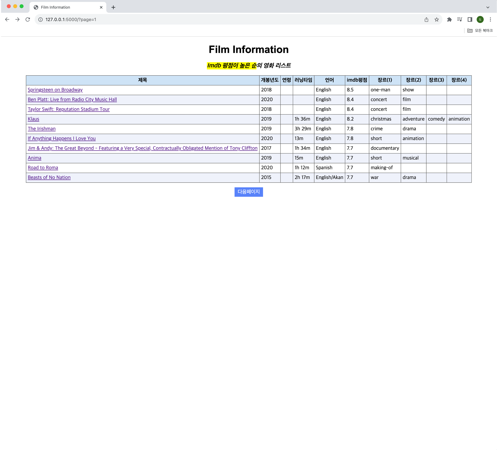
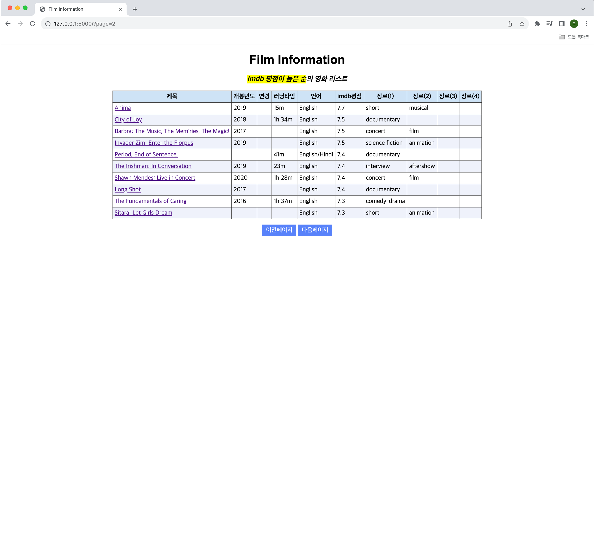
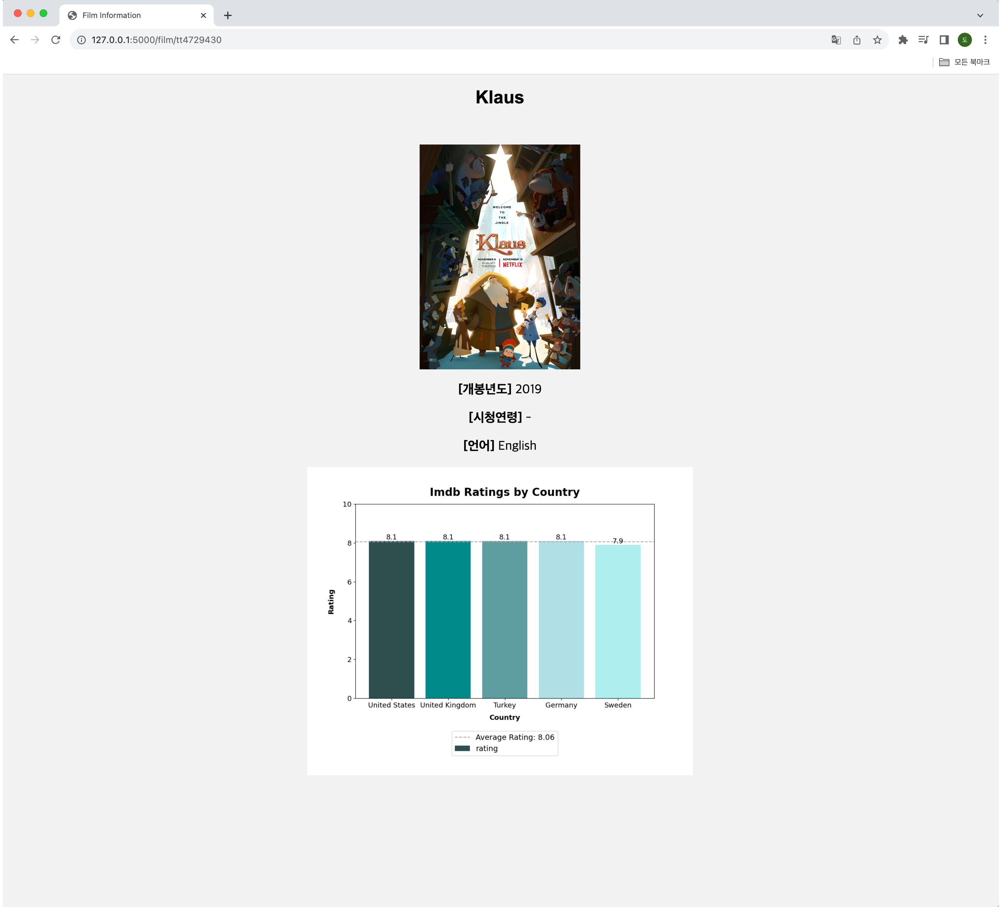

### About Project
넷플릭스 영화에 대해 IMDB 사이트에서의 나라별 평점을 시각화하는 프로젝트

IMDB 사이트의 평점이 계속 업데이트된다는 것을 이용하여 보고 싶은 영화에 대해 **나라별 최신 평점**을 확인하고자 한다. 이때, 영화를 구분하는 기준은 IMDB 사이트 주소에 있는 고유 코드값(이하 `Imdb_code`로 지칭)을 기준으로 한다.

사용 데이터셋: Kaggle [[Netflix Original Films & IMDB Scores](https://www.kaggle.com/datasets/luiscorter/netflix-original-films-imdb-scores)]

##
### [Film page] - 프로젝트 결과물
**1. 메인화면** - Flask를 이용하여 DB로부터 영화정보를 가져와서 보여주는 페이지

  
**2. 메인화면** - 페이지를 넘기면서 영화정보를 볼 수 있고, 영화 제목을 누르면 상세페이지로 넘어간다

  
**3. 상세페이지** - 해당 영화의 포스터 및 세부정보와 나라별 영화 평점을 보여주는 페이지( `Imdb_code`를 이용하여 DB로부터 데이터를 가져온다)  

#
##
_____

###
### [개발과정]
#### (2023.09 ~ 2023.11) 넷플릭스 영화 제목을 가지고 IMDB 사이트의 코드값 맵핑
* 과제1 - 영화명이 영문이 아니거나 특수문자가 포함된 경우에 대해 전처리
  * 해결 - Google에 검색해서 나오는 IMDB 영화 서칭
  

* 과제2 - 영화 명칭이 사이트별로 서로 다르게 표현된 경우에 대해 전처리 (ex. Netflix(Porta dos Fundos: The First Temptation of Christ) <-> Imdb(The First Temptation of Christ))
  * 해결 - 영화 세부정보(ex. 개봉년도, 장르)를 이용해서 동일한 영화인지 비교
  

* 과제3 - 동명의 영화가 존재하여 정확한 검색 결과가 안나오는 경우에 대해 전처리
  * 해결 - 영화 세부정보(ex. 개봉년도, 장르)를 이용해서 동일한 영화인지 비교
  

* 과제4 - 장르에 대해 서로 다르게 표현한 부분에 대해 전처리
  * 해결 - 영화에 대해 사이트별 장르를 list로 처리하여 장르가 겹치는지 확인

## 
#### (2023.11 ~) 맵핑이 완료되어 맵핑된 코드값을 가지고 IMDB 사이트의 나라별 평점을 수집하고 시각화 진행(with Flask)
* 과제1 - Flask를 이용하여 MysqlDB로부터 영화 정보를 불러오고, 나라별 평점 데이터를 차트로 시각화 진행
  * 해결 - 크롤링한 모든 정보를 JOIN하여 (영화정보/Json data/포스터 이미지)를 가진 메인 테이블을 CTAS로 생성
  * 영화정보/포스터 이미지 - _Flask를 이용하여_ `Imdb_code` _를 기준으로 해당 영화에 대한 정보를 DB로부터 가져온다._
  * 나라별 평점 데이터 - `json_data`_를 파싱하고 Python matplotlib 기능을 이용하여 막대 차트로 시각화한 이미지를 저장하여 가져온다._

* 과제2 - 코드값 매핑을 위해 작성한 코드 리팩터링

#

